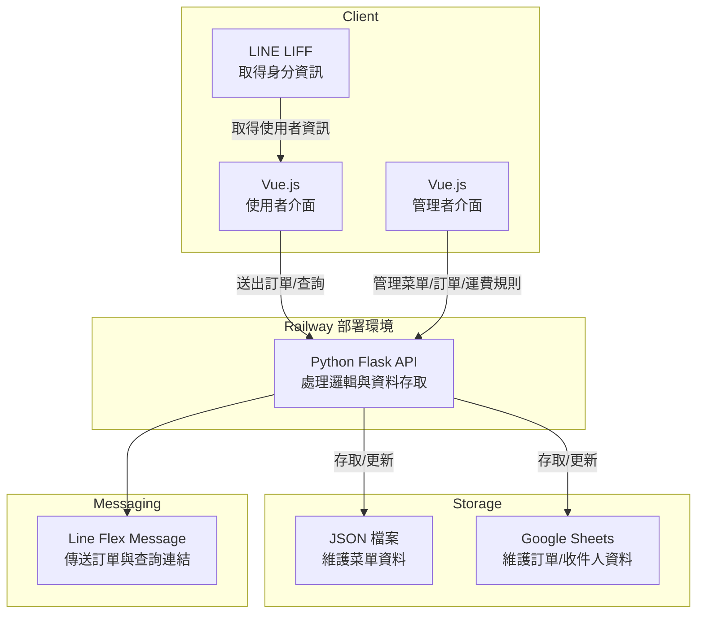

# Ordering System

## 專案簡介

這是一個完整的訂單管理系統，包含前端使用者介面與管理者介面，後端 API 整合 Google Sheets 與 JSON 檔案進行資料存取。系統支援以下功能：

- **使用者介面**: 提供訂單查詢與提交功能，整合 LINE LIFF 身分驗證。
- **管理者介面**: 管理菜單、查詢與修改訂單狀態、設定運費規則。
- **後端 API**: 使用 Flask 框架，處理邏輯與資料存取，並透過 LINE Flex Message 傳送訂單資訊。

系統架構設計簡潔且高效，適合展示於作品集，並可作為中小型訂單管理系統的基礎。

## 系統架構圖



## 專案架構

### 1. 前端 (Frontend)

- **技術棧**:
  - Vue 3
  - Vite
  - Tailwind CSS
  - Line Liff 提供身分驗證

- **目錄結構**:

  ```plaintext
  frontend/
  ├── src/
  │   ├── components/       # Vue 元件 (如 Admin.vue, Order.vue 等)
  │   ├── assets/           # 靜態資源 (如 vue.svg)
  │   ├── main.js           # Vue 應用入口
  │   ├── router.js         # 路由設定
  │   ├── style.css         # 全域樣式
  ├── public/               # 公共資源 (如 vite.svg)
  ├── index.html            # HTML 範本
  ├── package.json          # 專案依賴配置
  ├── tailwind.config.js    # Tailwind CSS 設定檔案
  ├── vite.config.js        # Vite 設定檔案
  └── README.md             # 前端 README 文件
  ```

### 2. 後端 (Backend)

- **技術棧**:
  - Flask 後端框架
  - Google Sheets API 外部資料服務
  - LINE Flex Message 訊息服務
- **目錄結構**:

  ```plaintext
  backend/
  ├── app.py                # Flask 主應用，需在專案根目錄執行
  ├── config.py             # 配置文件 (如環境變數)
  ├── flex_templates.py     # LINE Flex Message 模板生成
  ├── services/             # 外部服務整合 (如 Google Sheets, LINE Notify)
  │   ├── google_sheet.py   # Google Sheets API 集成
  │   ├── line_notify.py    # LINE Notify API 集成
  ├── static/               # 靜態文件 (如 HTML 模板)
  ├── utils.py              # 工具函數
  ├── menu.json             # 菜單配置文件
  ├── shipping_rules.json   # 運費規則配置文件
  └── README.md             # 後端 README 文件
  ```

### 3. 測試 (Tests)

- **技術棧**: pytest

- **目錄結構**:

  ```plaintext
  tests/
  ├── test_flex_message.py  # Flex Message 測試
  ├── line_messaging_api.py # LINE Messaging API 測試
  └── __init__.py           # 測試初始化文件
  ```

### 4. 靜態資源 (Assets)

- **目錄結構**:

  ```plaintext
  assets/
  ├── images/               # 圖片資源
  │   ├── step1.png         # 步驟 1 圖片
  │   ├── step2.png         # 步驟 2 圖片
  │   └── ...               # 其他圖片
  └── admin/                # 管理員相關圖片
      ├── admin_login.png   # 管理員登入界面
      ├── admin_orders.png  # 訂單管理界面
      └── ...               # 其他管理界面
  ```

### 5. 環境變數

- **前端**:
  - `VITE_LIFF_ID`: LINE LIFF ID

- **後端**:
  - `ORDER_DETAIL_BASE_URL`: 訂單明細 URL
  - `LINE_CHANNEL_ACCESS_TOKEN`: LINE 頻道存取權杖
  - `LINE_CHANNEL_SECRET`: LINE 頻道密鑰
  - `LINE_UID`: LINE 使用者 ID
  - `LINE_TEST_UID`: 測試用 LINE UID
  - `ADMIN_PASSWORD`: 管理員登入密碼
  - `FLASK_ENV`: Flask 執行環境 (development 或 production)
  - `PORT`: Flask 執行端口

### 6. 部署

- **前端**: 使用 Vite 建構並部署至靜態伺服器

- **後端**: 部署至 Railway 或其他支持 Flask 的平台

### 7. 開發指南

- **啟動前端**:

  ```bash
  cd frontend
  npm install
  npm run dev
  ```

- **啟動後端**:

  ```bash
  # project root
  # 確保在專案根目錄執行，避免部署到 Railway 發生路徑問題
  python -m backend.app
  ```

  > 目錄結構要求: Railway 部署時需要以模組方式執行後端程式，否則可能會因目錄結構問題導致應用無法啟動。
  >
  > 模組執行方式: 使用 python -m 可以正確地定位 backend 目錄並執行其中的 app.py。
